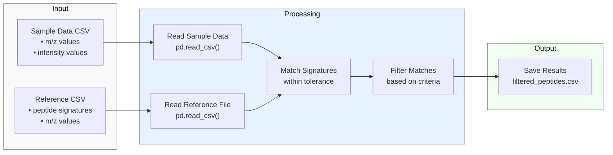

# Peptide Signature Finder

A Python tool for analysing mass spectrometry data using bottom-up proteomics approach, featuring interactive file selection and peptide signature matching.

##  Workflow Overview

The tool processes mass spectrometry data through several key steps:



##  Installation

To use this tool, install the required dependencies:

```bash
pip install pandas numpy
```

##  Features

- Interactive CSV file selection using tkinter dialogs
- Automatic validation of mass spectrometry data format
- Configurable ppm tolerance for peptide matching
- Comprehensive error handling
- Clear output showing matched peptides and their properties

##  Usage

The tool can be run directly from the command line:

```bash
python mass_spectra_analyzer.py
```

This will launch an interactive session where you'll be prompted to:

1. Select your sample data CSV file
2. Select your reference peptide signatures CSV file
3. Enter the desired ppm tolerance (default: 10)

##  Required File Formats

**Sample Data CSV**

- Must contain two columns:
  - m/z values (may be labeled as 'mass')
  - intensity values


- Example:

```csv
m/z,intensity
100.0,500
101.0,300
102.0,800
```

**Reference Peptides CSV**

- Must contain:
  - peptide_signature column (unique identifier for each peptide)
  - m/z values column


- Example:

```csv
peptide_signature,m/z
PEPTIDE1,100.5
PEPTIDE2,201.3
PEPTIDE3,302.7
```

##  Technical Details

The tool uses several key functions to process the data:

1. **File Selection**  - Uses tkinter's file dialog for interactive file selection
  - Filters for CSV files only
  - Prevents empty window display


2. **Data Validation**  - Checks for required columns in sample data
  - Standardizes column names
  - Handles missing or malformed data


3. **Peptide Matching**  - Calculates ppm differences between sample and reference peaks
  - Finds closest matches within specified tolerance
  - Returns comprehensive match information including:
    - Peptide signature
    - Reference m/z value
    - Matched m/z value
    - Intensity
    - PPM difference


##  Output

Results are saved to `filtered_peptides.csv` containing all matched peptides with their properties. The output includes:

- Peptide signatures
- Reference m/z values
- Matched m/z values
- Intensity values
- PPM differences

##  Contributing

Contributions are welcome! To contribute:

1. Fork the repository
2. Create a feature branch
3. Make your changes
4. Submit a pull request

##  License

This project is licensed under the MIT License. See `LICENSE` for details.

##  Acknowledgments

The tool uses:

- pandas for data manipulation
- numpy for numerical operations
- tkinter for file dialogs


   
   
